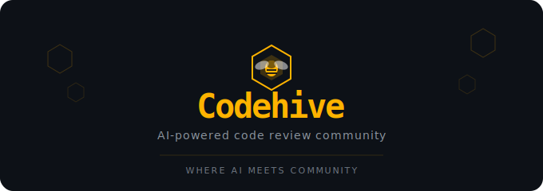

 

 
 
 

 
---

## 📌 프로젝트 소개

> 코드리뷰는 개발 품질을 높이는 핵심 과정이지만, 혼자 공부하는 개발자에게는 피드백을 받을 기회가 부족하다.
> AI가 즉각적인 1차 리뷰를 제공하고, 커뮤니티가 심층적인 인사이트를 더하는 플랫폼이 있다면 어떨까라는 질문에서 **Codehive**는 시작되었다.

 

## 🛠 기술 스택

### Frontend

### Backend

### DB

### AI

### Infra

## 🏗 System Architecture

  

## ✨ 주요 기능

 
| 기능 | 설명 |
|------|------|
| 🤖 **AI 자동 리뷰** | 코드 업로드 시 Claude AI가 즉시 1차 리뷰 제공 |
| 👥 **커뮤니티 리뷰** | 다른 개발자들이 추가 리뷰 및 댓글 작성 |
| 👍 **좋아요 / 추천** | 유용한 리뷰에 추천 기능 |
| 🔐 **회원가입 / 로그인** | JWT 기반 인증 시스템 |
| 📜 **리뷰 히스토리** | 내가 올린 코드와 받은 리뷰 모아보기 |
 

 
 
 
## 📎 Docs
 

 
| 문서 | 설명 |
|------|------|
| [🏗 Architecture](./docs/ARCHITECTURE.md) | 아키텍처 & 폴더 구조 |
| [📡 API](./docs/API.md) | API 명세 |
| [🗄 DB](./docs/DB.md) | DB 테이블 설계 |
| [🌿 Contributing](./docs/CONTRIBUTING.md) | 브랜치 규칙 & PR 방법 |
| [💻 Local Setup](./docs/LOCAL_SETUP.md) | 로컬 개발 환경 세팅 |
 

 
 
